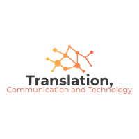

##  Department of Translation, Communication and Technology
### Institute for Translation and Interpreting, Heidelberg University

[Home](index.md) | [Team](people.md) | [Research](research.md) | [Collaboration](collaboration.md) | [Techologies](techlabs.md) |  

The Department of Translation, Communication and Technology has been founded with an aim to develop understanding of the technological impact on translation process.

Our projects focus on the advancement of research in modern translation technologies, on understanding the impact of the current Artificial Intelligence (AI) and Natural Language Processing (NLP) approaches on collaborative translation. We develop methods for systematically evaluating and improving the efficiency of different technological components and their synergies in collaborative translation workflows, creating a vision and new technologies for the next generation of computer-assisted translation systems. With support from Heidelberg University's Research Councils FoF3 grant for our project "Collection, recording and processing linguistic and multimedia data for empirical analyses" we are creating a corpus infrastructure in Digital Humanities, which includes electronic corpora, linguistic and translation resources, conference interpreting transcripts, eye tracking data for computer-assisted translation and interpreting.

Our research and technology development engage with the changing role of translation in modern interconnected cultures and societies, as well as with converging trends of an increasing demand and a much higher quality of automated translation. On the one hand, translators now have moved from working on predominantly literary texts (as in the past) to translating and localising industrial technical documentation, which needs to be released together with products in multiple languages for international market. This calls for collaborative automated translation of large volumes of text within tight deadlines, ensuring high quality, stylistic and terminological consistency across projects. On the other hand, translation automation systems, such as Machine Translation (MT) Translation Memories (TMs), electronic corpora, terminology management and collaborative translation platforms, have become more useful in recent years, delivering measurable gains in translators' productivity. There is a potential for integrating other AI and NLP methods and tools into the translation workflow, such as word embeddings, semantic similarity detection, information extraction, ontologies and semantic web, argumentation mining, automatic inference, sentiment analysis. However, the challenge is to identify a most efficient use and interaction for these methods and technologies in collaborative translation workflows.

Our teaching addresses industry's demand for a new generation of translation and technology specialists, who have excellent language skills, but can also become advisers for their teams on the process management and technology development, 'connecting the dots' in translation workflows. They should be able to evaluate usability of translation tools, the efficiency of the workflow, communicate linguistic requirements and design specifications for next generation of translation technologies, combine necessary components and approaches, linguistic specifications.  For example, they could design a simplified technical controlled language for their domain, propose technological linguistic solutions for their team, e.g., on automatic authoring and conformity checks in the controlled language. They would be able to evaluate MT quality, post-editing effort, usability, for a specific project, client or domain, to systematically identify errors and to design automated correction procedures for error-critical areas of MT, suggest ways to improve the process via customising MT, multi-engine MT combination, optimising the design of the workflow, build and manage relevant linguistic resources for low-resourced language or domains.

Nowadays technological changes in translation industry are often driven by market demands; however, this may result in ad-hoc quick fixes and technical shortcuts, which although may improve productivity in the short term, are hard to manage and develop further. Our task is to create a systematic theoretically-grounded approach to creating, using and evaluating translation technologies, to build a coherent scientific basis for shaping these technological changes in the future.

#### Webpage in other languages

 en  [de](de_index.md)  [uk](uk_index.md)
