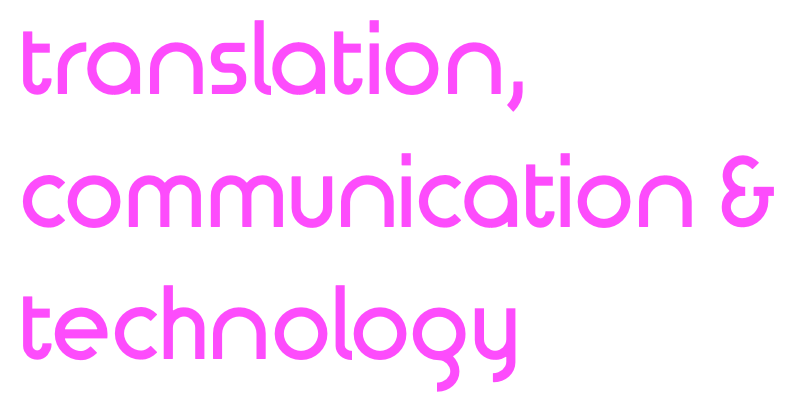

## Відділення перекладу, комунікації та технології
### Інститут письмового та усного перекладу, Гайдельберзький університет

[Home](index.md) | [Team](people.md) | [Research](research.md) | [Collaboration](collaboration.md) | [Techologies](techlabs.md) |  

The Department of Translation, Communication and Technology has been founded in 2020 with an aim to develop understanding of the technological impact on translation process.

#### Сторінка іншими мовами

 [en](index.md)  [de](de_index.md)  uk  
